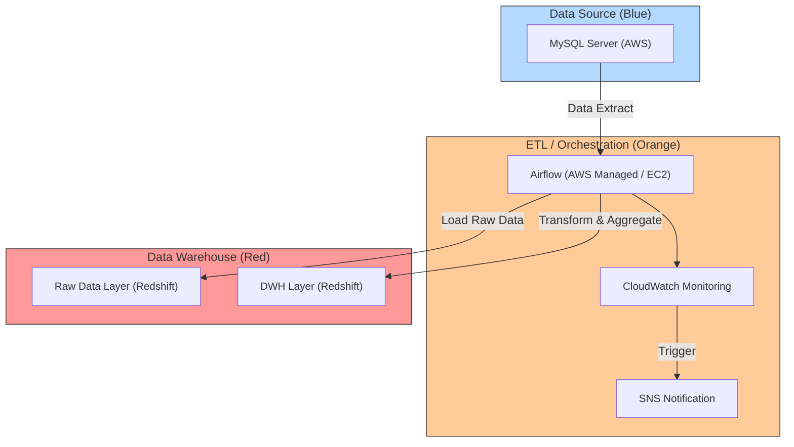

# AWS-DWH-Platform

```mermaid
flowchart TB
    %% === Class Definitions ===
    classDef bigFont font-size:14px;

    %% === Data Source ===
    subgraph SOURCE["Data Source (Blue)"]
        style SOURCE fill:#b3d9ff,stroke:#333,stroke-width:1px
        MYSQL["MySQL Server (AWS)"]
    end
    class MYSQL bigFont;

    %% === ETL / Orchestration ===
    subgraph ETL["ETL / Orchestration (Orange)"]
        style ETL fill:#ffcc99,stroke:#333,stroke-width:1px
        AIRFLOW["Airflow (AWS Managed / EC2)"]
        CLOUDWATCH["CloudWatch Monitoring"]
        SNS["SNS Notification"]
    end
    class AIRFLOW,CLOUDWATCH,SNS bigFont;

    %% === Data Warehouse ===
    subgraph DWH["Data Warehouse (Red)"]
        style DWH fill:#ff9999,stroke:#333,stroke-width:1px
        RAW_LAYER["Raw Data Layer (Redshift)"]
        DWH_LAYER["DWH Layer (Redshift)"]
    end
    class RAW_LAYER,DWH_LAYER bigFont;

    %% === Flow ===
    MYSQL -->|Data Extract| AIRFLOW
    AIRFLOW -->|Load Raw Data| RAW_LAYER
    AIRFLOW -->|Transform & Aggregate| DWH_LAYER
    AIRFLOW --> CLOUDWATCH
    CLOUDWATCH -->|Trigger| SNS

```